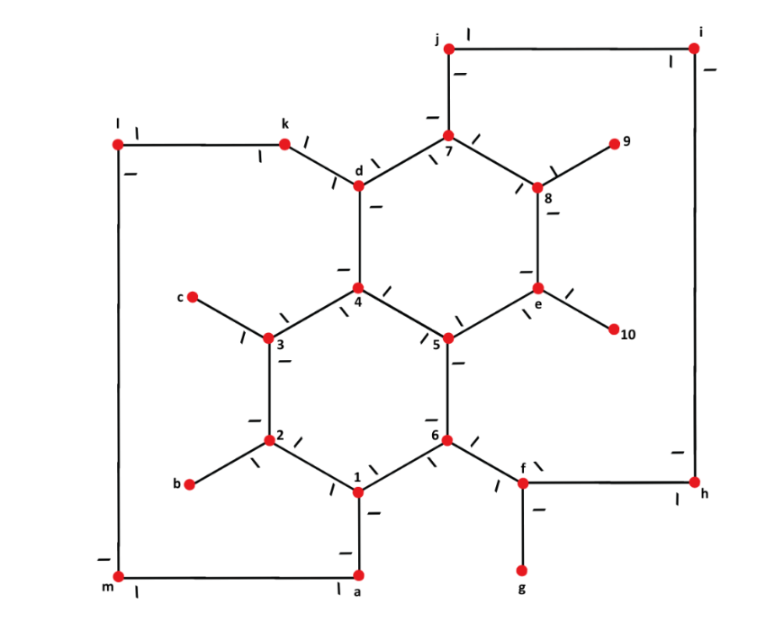

# System overview
The robot follows a path represented by a ground line, which may have decision points (e.g. forks). Upon reaching a decision point, the robot is decides what to do (turn left, turn right, moving forward).

Small signals at right of the line mark a decision point ahead. Notice that decision point detected and line following control is implemented in the firmware, without requiring any decision from the robot. 

## Agent description
The agent can move around the map by performing the following internal actions:
- `.front` → to move forward
- `.left` → to turn left
- .`right` → to turn right.

While running, the agent may have the following perceptions:
- `fork_detected`, when there is not line to follow and a decision is required (e.g. turn left or right);
- `path_detected` when a line is detected and the agent can move forward.

## Firmware description
The system implements a **line-following robot with decision-point detection and agent deliberation support**.  
Its control logic is executed on an Arduino platform, integrating motor control, optical line sensors, and a communication layer for coordination with an external agent.

The firmware expects some of the following commands (so-called *actuations*) from the agent reasoning system:
- `move_front` → to move forward
- `move_left` → to turn left
- `move_right` → to turn right.

These *actuations* are produced by the actions of the agent described above, as summarized below:
| Agent action | Firmware actuation |
|---------------|--------------------|
| `.front`      | `move_front`       |
| `.left`       | `move_left`        |
| `.right`      | `move_right`       |

These behaviours are explained below:
- *moving forward*: the vehicle keeps in continuous forward motion with line-following correction. After detecting a decision mark, the vehicle continues forward until loosing line detection, when it stops. The firmware sends the perception `path_decision_required` to the agent. 
- *turning left*: the vehicle turns left until the line is detected. The firmware sends the perception `line_detected` to the agent.
- *turning right*: the vehicle turns right until the line is detected. The firmware sends the perception `line_detected` to the agent. 

